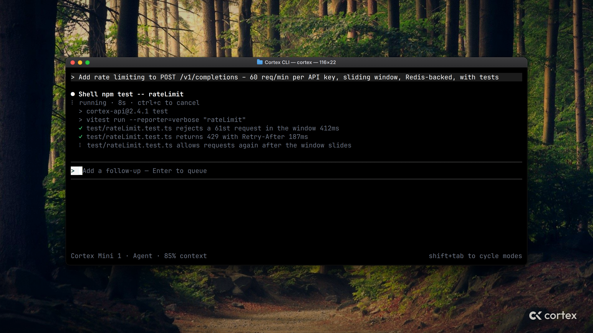
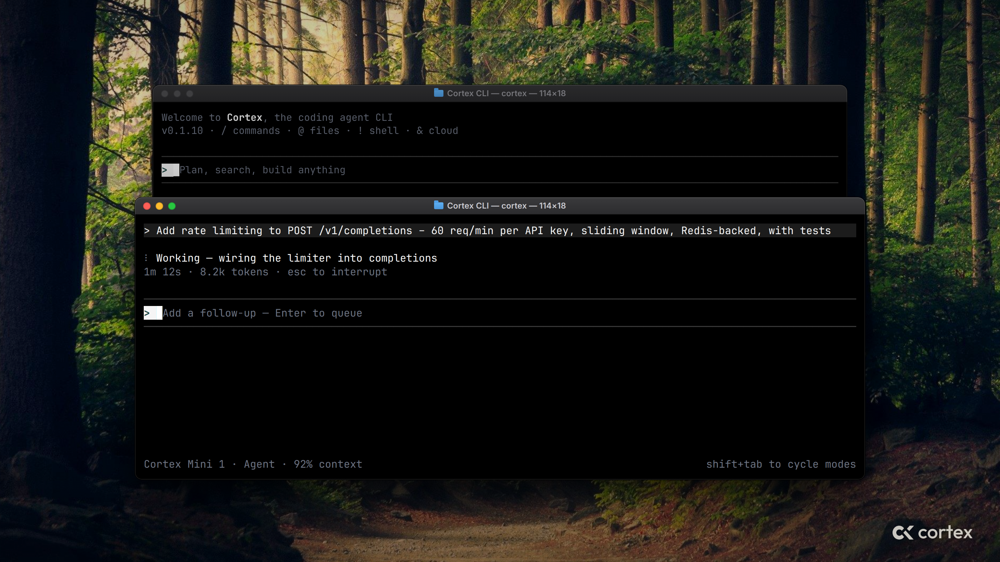
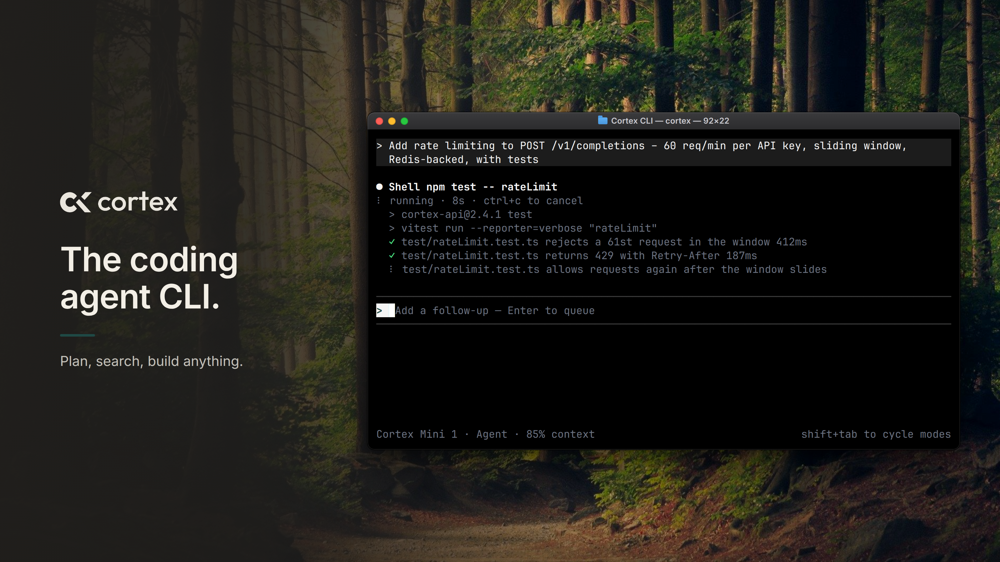

# Cortex CLI — Twitter/X launch stills

Landscape cards for the launch tweet. All four files are **3200 × 1800 px**
(1600 × 900 @2x, 16:9), PNG, under 5 MB — ready to attach to a post as-is.

## Recommended post: `a-single-window.png`



One clear hero: a single macOS Terminal window, mid-session. The user asked
for rate limiting on `POST /v1/completions`; the agent is running the Shell
tool (`npm test -- rateLimit`), two tests are already green, the follow-up
composer sits between its dual hairlines with the green-on-cream caret, and the
footer shows `Cortex Mini 1 · Agent · 85% context`. Largest type of the three,
no copy to compete with the tweet text. Discreet `cortex` lockup bottom-right.

Suggested alt text: *Cortex CLI running in a macOS Terminal window. A prompt
asks for rate limiting on POST /v1/completions; the agent runs the test suite
and two rate-limit tests pass while a third is still running.*

## Alternates

| File | Layout | When to use |
|------|--------|-------------|
| `b-layered-windows.png` | Splash card (unfocused) stacked behind the live "Working" session | Tells the start → agent-working story in one frame; slightly smaller type |
| `c-caption-left.png` | Ink caption area left (lockup, *The coding agent CLI.*, *Plan, search, build anything.*), Terminal right | When the image has to carry the headline on its own (quote-tweets, link previews) |
| `c-caption-left-blank.png` | Same as C with the caption area empty | Overlay your own copy in the cream `#F3EFE6` on the ink gradient |





## What is real

Nothing in the terminals is drawn by hand. Every window shows a frame recorded
from the signed lock TUI by `generate_tui_demo` — the same recorder that
produces `docs/media/intro.gif` — rasterised with JetBrains Mono at 2×. The
copy in C is product copy (the splash tagline and the composer placeholder).

- Wallpaper: `docs/media/macos-wallpaper-green.jpg`
- Window chrome: Terminal.app dark appearance (traffic lights, proxy icon, title `Cortex CLI — cortex — cols×rows`)
- Lockup: lifted from `assets/banner.jpg`, recoloured cream
- Palette: ink `#211F1C`, cream `#F3EFE6`, green `#1F4945` (caret and rule) — no other accent

## Regenerate

```bash
sudo apt-get install -y libasound2-dev libssl-dev pkg-config   # once, for the cargo build
python3 -m pip install pillow
cargo build -p cortex-tui --bin generate_tui_demo
python3 design/cli-twitter-promo/render.py            # all four stills
python3 design/cli-twitter-promo/render.py --only a   # one of a, b, c, c-blank
```

Needs Google Chrome or Chromium on `PATH` and the JetBrains Mono + Inter fonts
installed. Each scene's terminal size and cell width live at the top of the
`scene_*` functions in `render.py`.
