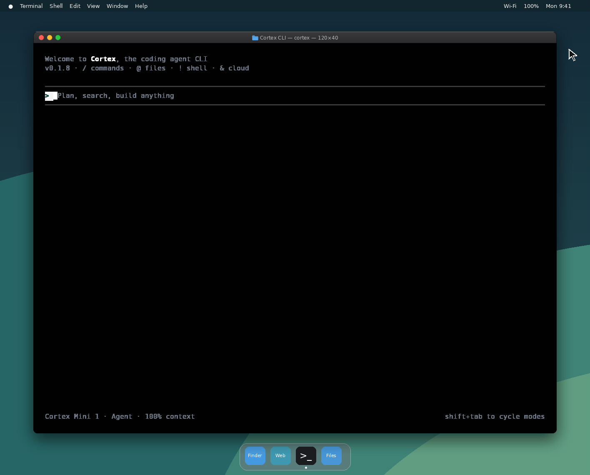

# Cortex CLI documentation

Cortex CLI (also called **Cortex Code**) is a coding agent that runs in your terminal.
It ships one binary, `Cortex`, that gives you an interactive TUI, a headless
one-shot mode for scripts and CI, and the surrounding machinery — tools, MCP
servers, skills, agents, plugins, hooks, sessions and permissions.

New here? Start with **[Getting started](guides/getting-started.md)**, then keep
**[CLI reference](reference/cli.md)** open in another tab.

## Contents

### Guides

| Page | What it covers |
|------|----------------|
| [Getting started](guides/getting-started.md) | Install, sign in, and run your first session |
| [The TUI](guides/tui.md) | The interactive UI: timeline, composer, modes, approvals |
| [Sessions](guides/sessions.md) | Resume, list, export, import, share, protect |
| [Headless / exec mode](guides/exec.md) | Non-interactive runs for scripts and CI |
| [Plan and Spec modes](guides/plan.md) | Get a plan approved before anything is written |

### Configuration

| Page | What it covers |
|------|----------------|
| [Configuration files](configuration/config.md) | Discovery order, `config.toml` keys, profiles |
| [Environment variables](configuration/env.md) | Every variable the CLI reads, by name |
| [Data locations](configuration/data-locations.md) | Where config, sessions, logs and caches live |

### Customization

| Page | What it covers |
|------|----------------|
| [Agents](customization/agents.md) | Built-in agents, custom agent files, subagents |
| [MCP servers](customization/mcp.md) | Connect Model Context Protocol servers |
| [Skills](customization/skills.md) | Reusable instruction bundles the agent can load |
| [Hooks](customization/hooks.md) | Run your own commands on agent lifecycle events |
| [Plugins](customization/plugins.md) | WebAssembly plugins, their manifest and lifecycle |
| [Themes](customization/themes.md) | Built-in themes and how to switch them |

### Reference

| Page | What it covers |
|------|----------------|
| [CLI reference](reference/cli.md) | Every command and flag |
| [Tools](reference/tools.md) | The tools the agent can call |
| [Slash commands](reference/slash-commands.md) | Everything you can type after `/` in the TUI |
| [Keyboard shortcuts](reference/keyboard.md) | Key bindings by context |
| [Signing in](reference/login.md) | Browser, device-code, SSO and token sign-in; the keyring |

### Operations

| Page | What it covers |
|------|----------------|
| [Troubleshooting](troubleshooting.md) | Common failures and how to diagnose them |
| [Contributing](CONTRIBUTING.md) | Filing issues, PR conventions, required checks |
| [CI secrets](CI_SECRETS.md) | Secret *names* the release workflows expect |

## Conventions used here

- Commands are written as `cortex …`. The installed binary is `Cortex`; on
  case-insensitive filesystems and via the install script both spellings work.
  A local debug build is `./target/debug/Cortex`.
- Anything documented here is backed by the code in this repository. If a flag
  is missing from a page, check `cortex <command> --help`, which is generated
  from the same definitions.
- Cortex CLI talks to the Cortex API at
  [api.cortex.foundation](https://api.cortex.foundation) and signs in through
  [auth.cortex.foundation](https://auth.cortex.foundation). Releases are
  published to [software.cortex.foundation](https://software.cortex.foundation).
